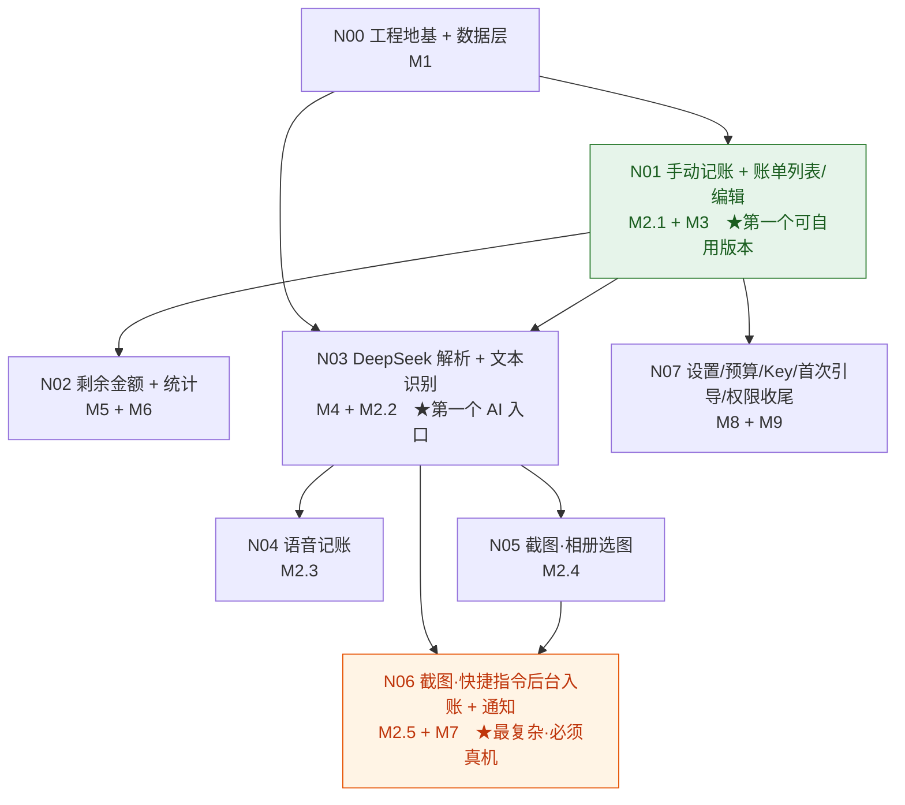

# Aubade v1 需求 DAG 总控文档

## 给用户看的摘要

这份文档把技术基线里的模块（M1~M9）和开发顺序，拆成 **8 个可以一个一个做完的开发节点**（N00~N07），并画清它们的先后依赖。它是后续开发的"总控台"：你随时能看到做到哪了、下一个该做什么、每个节点做到什么程度算完成。

**推荐开发顺序（就是节点编号顺序）**，核心思路是"**先做不依赖 AI、不依赖真机的最小闭环，再逐个接入识别能力，把最不可控的截图后台链路放到最后**"：

1. **N00 工程地基 + 数据层**：建 Xcode 工程、SwiftData 四张表、预置分类。这是所有功能的底座。
2. **N01 手动记账 + 账单列表/编辑**：打通"记一笔 → 看流水 → 改/删"，**完全不用 AI 也能日常用**——这是你的第一个可自用版本。
3. **N02 剩余金额 + 统计**：在账单数据上算"还剩多少"和"本周/本月花了多少"、分类占比、趋势、预算超支提示。
4. **N03 DeepSeek 解析 + 文本识别**：接入第一个 AI 入口，粘贴短信一键记账——**PRD 最核心的省事功能**。
5. **N04 语音记账**：复用 N03 的解析，前面加本地语音转文字。
6. **N05 截图·相册选图**：复用解析，前面加本地 OCR，仍是前台流程。
7. **N06 截图·快捷指令后台入账 + 通知**：**最复杂、必须真机验证**的主入口，单独成节点，风险隔离在最后。
8. **N07 设置/预算/Key/首次引导/权限收尾**：补齐配置、首次引导和所有异常提示。

**为什么这么拆**：每个节点都能独立跑通、独立验收；AI 和平台能力从"最可控"到"最不可控"逐步接入；即便 N06 截图后台链路在真机上要反复调，也不影响 N01~N03 先交付自用。

**需要你确认什么**：主要是这个**节点顺序和边界**是否认可——尤其是 (a) 把"能自用的最小闭环"定在 N01（手动记账即可用）、(b) 截图后台链路 N06 独立放最后。如果认可，回复"DAG 评审通过"，我就初始化第一个节点 N00 进入正式节点 PRD/TRD 开发。

---

## 文档定位

- 本文档（DAG）是 **节点顺序、依赖关系、节点状态和退出标准的事实来源**。
- 正式的**节点 PRD** 保存在 `docs/prd/nodes/`，正式的**节点 TRD** 保存在 `docs/design/nodes/`。
- `.claude/jflow/` 只保存 active 执行状态、dev-log、handoff 和恢复指针，不保存正式产物。
- 本文档不写实现代码，也不替代节点 PRD/TRD；它只负责"把大项目切成有序的小节点，并记录做到哪了"。

## 项目文档路径

- 全局 PRD：`docs/prd/aubade-v1-prd.md`
- 原型文档：`docs/design/aubade-v1-prototype.md`
- 技术基线：`docs/design/aubade-v1-technical-baseline.md`
- 开发 DAG：`docs/design/aubade-v1-dev-dag.md`（本文件）
- 真实交互 demo：`prototype/app/index.html`

节点级正式文档（选中节点后由 Jflow 按需创建）：

- 节点 PRD：`docs/prd/nodes/<nodeId>-<slug>-prd.md`
- 节点 TRD 索引：`docs/design/nodes/<nodeId>-<slug>/00-index.md`
- 节点 TRD 切片：`docs/design/nodes/<nodeId>-<slug>/01-<slice>-trd.md`（按需递增）
- 节点切片进度：`docs/design/nodes/<nodeId>-<slug>/99-slice-progress.md`

## 使用方式

1. 看**节点追踪表**了解整体进度与当前可开发节点。
2. 选一个"无依赖或依赖已全部完成"的节点，用 handoff 命令初始化 Jflow 状态（见"个人恢复规则"）。
3. 进入该节点后，先出节点 PRD（`jflow-start`），评审通过后出节点 TRD（`jflow-trd`），再按 TRD 切片开发（`jflow-dev`），每次最多实现一个切片。
4. 节点达到**退出标准**后标记完成，回到本表选下一个节点。

## 个人恢复规则

- `docs/design/aubade-v1-dev-dag.md`（本文件）是 DAG 节点状态、依赖关系和退出标准的事实来源。
- `docs/prd/nodes/*.md` 是正式节点 PRD 的事实来源。
- `docs/design/nodes/*/00-index.md` 及同目录切片文件是正式节点 TRD 的事实来源。
- `.claude/jflow/` 只保存 active 执行状态、dev-log、handoff 和恢复指针。
- 除非用户明确要求，否则每次 Jflow 调用最多实现一个当前 TRD 切片。
- 下一次恢复时，优先读取 `.claude/jflow/features/aubade/current.json`、当前节点 `handoff.md`、节点 `99-slice-progress.md` 和本 DAG。

## DAG



> 图中每条箭头对应"节点追踪表"里的一条**直接依赖**（指向节点 = 前置必须先完成）。一个节点的全部入边就是它的完整前置集合，无需再做传递推理。绿色 = 第一个可自用版本，橙色 = 必须真机验证的最复杂节点。

依赖说明：

- **N00** 无依赖，是所有节点的地基。
- **N01** 依赖 N00（需要数据模型）。
- **N02** 依赖 N01（需要账单数据才能算剩余与统计）。
- **N03** 依赖 N00 + N01（写入账单、复用结果卡片/编辑）；不强依赖 N02，但推荐顺序上 N02 先做（N03 的"分类改后统计同步"由 N02 提供）。
- **N04、N05** 各自依赖 N03（复用 DeepSeek 解析层与结果卡片）；N04 与 N05 相互独立，可任意先后。
- **N06** 依赖 N03（复用解析链路）+ N05（复用 OCR 能力），**不依赖语音 N04**；是风险最高的真机节点。
- **N07** 依赖 N01（设置/预算作用于账单与统计）；其收尾内容（Key 配置、首次引导、权限、通知开关）与各 AI 节点交叉，安排在最后统一补齐。Key 的 Keychain 读写若被 N03 提前需要，可在 N03 内先做最小实现，N07 再完善。

## 节点状态

状态取值：`todo`（未开始）/ `in_progress`（进行中）/ `done`（已完成）/ `blocked`（被阻塞）。

当前整体状态：**开发中**；N00、N01 已完成（N01 = 第一个可自用版本，手动记账 + 账单列表/筛选/编辑/删除闭环）。下一个可开发节点 **N02 剩余金额 + 统计**（依赖 N01 已满足）。

## 节点追踪表

| Node ID | 名称 | 状态 | 依赖 | 对应技术基线模块 | 可自用里程碑 |
|---|---|---|---|---|---|
| N00 | 工程地基 + 数据层 | done | — | M1 | — |
| N01 | 手动记账 + 账单列表/编辑 | done | N00 | M2.1 + M3 | ✅ 第一个可自用版本 |
| N02 | 剩余金额 + 统计 | todo | N01 | M5 + M6 | ✅ 能看花销与结余 |
| N03 | DeepSeek 解析 + 文本识别 | todo | N00, N01 | M4 + M2.2 | ✅ 粘贴短信一键记账 |
| N04 | 语音记账 | todo | N03 | M2.3 | — |
| N05 | 截图·相册选图 | todo | N03 | M2.4 | — |
| N06 | 截图·快捷指令后台入账 + 通知 | todo | N03, N05 | M2.5 + M7 | ✅ 截图主入口（真机） |
| N07 | 设置/预算/Key/首次引导/权限收尾 | todo | N01 | M8 + M9 | ✅ 配置与异常闭环 |

## 节点详情

### N00 工程地基 + 数据层

- **Node ID**：N00
- **名称**：工程地基 + 数据层
- **状态**：done
- **依赖**：无
- **前端范围**：无用户可见行为（纯地基）。
- **PRD 路径**：`docs/prd/nodes/n00-foundation-data-prd.md`
- **TRD 入口路径**：`docs/design/nodes/n00-foundation-data/00-index.md`
- **范围**：创建 Xcode 工程（iOS 17+，SwiftUI 生命周期）；定义 SwiftData 四个模型 `Transaction`/`Category`/`Budget`/`BalanceBaseline`（字段见技术基线 §8，金额用 `Decimal`；分类模型代码类型名落地为 `LedgerCategory`，避开与 ObjC runtime `Category` 冲突，语义不变）；`ModelContainer` 初始化；首次启动装载预置分类（衣/食/住/行/玩/其他 + 工作/其他收入）；基础读写封装。
- **关键约束**：金额一律 `Decimal`；**App Group 路线判定尽量在本节点前移**——若倾向截图后台走"独立扩展进程"，建库时就应按 App Group 共享容器建，避免后期存储迁移返工（见技术基线 §11 第 1 条）。
- **退出标准（可观察）**：工程能在 iOS 17+ 目标上编译运行；首次启动后预置分类已写入并可查询到；四个模型可增删改查（可用一个临时调试入口或单元测试验证）。
- **下一次恢复入口**：`docs/design/nodes/n00-foundation-data/99-slice-progress.md`

### N01 手动记账 + 账单列表/编辑

- **Node ID**：N01
- **名称**：手动记账 + 账单列表/编辑
- **状态**：done
- **依赖**：N00
- **前端范围**：记账 Tab 的"手动输入"表单；账单 Tab 的流水列表（按日期分组、分类彩色标签、金额醒目）、分类/时间范围筛选、账单详情/编辑页、删除二次确认；记账 Tab 的"最近记录"与"今日已记 N 笔"。
- **PRD 路径**：`docs/prd/nodes/n01-manual-ledger-prd.md`
- **TRD 入口路径**：`docs/design/nodes/n01-manual-ledger/00-index.md`
- **范围**：手动记账表单（金额/方向/分类/日期/备注）→ 保存入账；账单列表浏览/筛选/编辑/删除；结果卡片编辑组件的基础形态（供后续 AI 节点复用）。
- **退出标准（可观察）**：能手动新增一笔账单并出现在列表（验收点 5）；列表可编辑与删除、删除有二次确认（验收点 10 的编辑删除部分）；可按分类和时间范围筛选且结果一致（验收点 12）；空状态引导正确。
- **下一次恢复入口**：`docs/design/nodes/n01-manual-ledger/99-slice-progress.md`

### N02 剩余金额 + 统计

- **Node ID**：N02
- **名称**：剩余金额 + 统计
- **状态**：todo
- **依赖**：N01
- **前端范围**：我的页/账单页顶部的剩余总额展示与"调整初始总额"；统计 Tab 全部——「日/周/月/年」粒度切换 +「‹ ›」时间导航（不能翻到未来）、总支出/总收入、日档流水、周/月/年档趋势折线（横轴跟随粒度）、分类占比及下钻明细、周/月档预算进度与超支标红。
- **PRD 路径**：`docs/prd/nodes/n02-balance-analytics-prd.md`
- **TRD 入口路径**：`docs/design/nodes/n02-balance-analytics/00-index.md`
- **范围**：剩余金额计算（初始总额 + 基线后收入 − 支出，无基线显示"—"）；统计聚合（四档区间合计、分类占比、趋势序列、预算进度与 80%/100% 阈值）；粒度切换时导航归位到当前、本期无数据显示占位（原型 §4.6 契约）。预算的**设置入口**可放 N07，本节点先消费已有预算值。
- **退出标准（可观察）**：录入初始总额后剩余 = 初始 + 收入 − 支出（验收点 9）；统计页周/月合计与分类占比正确（验收点 7）；设预算后进度与超支标红正确（验收点 8，本节点通过临时调试入口/单测直接写入 Budget 验证，正式设置入口在 N07）；账单增删改后剩余与统计同步（验收点 10 的同步部分）；日/周/月/年切换与导航符合原型（不能翻未来、无数据占位）。
- **下一次恢复入口**：`docs/design/nodes/n02-balance-analytics/99-slice-progress.md`

### N03 DeepSeek 解析 + 文本识别

- **Node ID**：N03
- **名称**：DeepSeek 解析 + 文本识别
- **状态**：todo
- **依赖**：N00, N01
- **前端范围**：文本识别页（粘贴框 + 读取剪贴板）；识别中态；识别结果卡片（复用 N01 编辑组件，账单已入账、可当场改、可"删除这笔"撤销）；未配置 Key 的拦截提示。
- **PRD 路径**：`docs/prd/nodes/n03-deepseek-text-prd.md`
- **TRD 入口路径**：`docs/design/nodes/n03-deepseek-text/00-index.md`
- **范围**：DeepSeek Client（URLSession 调 OpenAI 兼容接口，仅传文本；输入=原文+分类清单+JSON 约束，输出=金额/方向/时间/商户/卡尾号/分类）；归一与分类兜底；错误类型（无 Key/网络失败/超时/无金额/非法响应）；文本识别入口串起"取文本 → 解析 → 直接入账 → 结果卡片"；Key 的 Keychain 最小读写（完整设置界面留 N07）。
- **关键约束**：DeepSeek/Vision/Speech 以**协议抽象 + mock** 注入，便于单元测试；解析不出金额=失败，走保留原文转手动。
- **退出标准（可观察）**：粘贴一条工行消费短信/含金额文字能解析出方向/金额/时间并直接入账（验收点 4）；自动带分类且可改（验收点 6 的分类可改部分；改后统计同步由 N02 承接）；未配置 Key 时给明确提示、手动记账不受影响（验收点 11 前台部分）；无法解析金额时不报错、保留原文转手动（验收点 13 前台部分）。
- **下一次恢复入口**：`docs/design/nodes/n03-deepseek-text/99-slice-progress.md`

### N04 语音记账

- **Node ID**：N04
- **名称**：语音记账
- **状态**：todo
- **依赖**：N03
- **前端范围**：记账 Tab 的"语音记账"→ 按住说话 → 识别中 → 结果卡片。
- **PRD 路径**：`docs/prd/nodes/n04-voice-capture-prd.md`
- **TRD 入口路径**：`docs/design/nodes/n04-voice-capture/00-index.md`
- **范围**：iOS Speech 本地转文字（`requiresOnDeviceRecognition = true`，检查 `supportsOnDeviceRecognition`，中文本地不可用时降级/提示）；转出的文本复用 N03 解析链路与结果卡片；麦克风+语音识别权限申请与被拒降级。
- **退出标准（可观察）**：说一句"打车花了 20"能生成金额 20、方向支出、分类"行"的已入账账单（验收点 3）；权限被拒时有明确降级提示；语音不外传（本地识别）。
- **下一次恢复入口**：`docs/design/nodes/n04-voice-capture/99-slice-progress.md`

### N05 截图·相册选图

- **Node ID**：N05
- **名称**：截图·相册选图（备选入口，前台）
- **状态**：todo
- **依赖**：N03
- **前端范围**：记账 Tab"截图识别"说明卡（讲清主入口是快捷指令 + 两步设置指引）；卡内"从相册选一张图识别" → 识别中 → 结果卡片。
- **PRD 路径**：`docs/prd/nodes/n05-screenshot-album-prd.md`
- **TRD 入口路径**：`docs/design/nodes/n05-screenshot-album/00-index.md`
- **范围**：相册选图；iOS Vision 本地 OCR（配置中文 `recognitionLanguages` zh-Hans/zh-Hant 与识别精度）；OCR 文本复用 N03 解析链路与结果卡片；相册权限申请与被拒降级。此节点产出的 **Vision OCR 能力供 N06 复用**。
- **退出标准（可观察）**：在 App 内"截图识别 → 从相册选图"选一张付款截图，能本地识别、解析并直接入账（验收点 2）；图片不外传（本地 OCR）。
- **下一次恢复入口**：`docs/design/nodes/n05-screenshot-album/99-slice-progress.md`

### N06 截图·快捷指令后台入账 + 通知

- **Node ID**：N06
- **名称**：截图·快捷指令后台入账 + 通知（主入口，真机）
- **状态**：todo
- **依赖**：N03, N05
- **前端范围**：无常规界面（后台执行）；用户可见的是**本地通知**（成功"已记一笔 · 金额 · 分类"、失败"没识别出，点此补录"、无 Key 提示）与点击通知后的路由（成功→结果卡片、失败→手动补录带出原文/原图）。
- **PRD 路径**：`docs/prd/nodes/n06-shortcut-background-prd.md`
- **TRD 入口路径**：`docs/design/nodes/n06-shortcut-background/00-index.md`
- **范围**：App Intents 暴露"记录 Aubade 截图"动作；后台链路 OCR→DeepSeek→入账→通知（技术基线 §7.3）；后台超时/失败/无网/无 Key 兜底（不生成脏账、保留原图、发对应通知）；`ModelContainer` 与后台进程共享（是否 App Group，衔接 N00）；原图临时留存与清理；UNUserNotificationCenter 通知构造/权限/点击路由。
- **关键约束（真机专项）**：**两个并列的头号真机验证项**——(1) 后台执行时间预算能否容纳一次 DeepSeek 往返；(2) 快捷指令"如何把截图可靠交给 App Intent"的传图机制是否成立。建议先做最小 spike。若后台预算普遍不足，触发技术基线 §7.3 **方案 B 降级**（后台只做 OCR+通知，点通知进 App 前台完成解析入账）。模拟器测不准，必须真机。
- **退出标准（可观察，真机）**：真机上触发快捷指令把付款截图发给 Aubade，后台完成本地 OCR→解析→直接生成已入账带分类账单并弹含金额/分类的本地通知（验收点 1）；后台识别失败弹失败通知且**不生成账单**、原图保留、点开可补录（验收点 13 后台部分）；未配置 Key 后台触发时以通知形式提示（验收点 11 后台部分）。若走方案 B 降级，则以降级后的可观察行为达成等价验收并在节点文档记录。
- **下一次恢复入口**：`docs/design/nodes/n06-shortcut-background/99-slice-progress.md`

### N07 设置/预算/Key/首次引导/权限收尾

- **Node ID**：N07
- **名称**：设置/预算/Key/首次引导/权限收尾
- **状态**：todo
- **依赖**：N01（其余内容与各 AI 节点交叉，安排在最后统一补齐）
- **前端范围**：我的页（剩余总额+调整初始总额、周/月预算设置、DeepSeek Key 填写与"已配置✓/去填写"状态、分类管理查看）；首次启动引导（录初始总额 → 提示配置 Key，可跳过 → 落到空账本记账页）；通知开关；各权限被拒的统一降级提示。
- **PRD 路径**：`docs/prd/nodes/n07-settings-onboarding-prd.md`
- **TRD 入口路径**：`docs/design/nodes/n07-settings-onboarding/00-index.md`
- **范围**：Keychain Key 读写完整化（"已配置"判定）；预算设置（周/月）落库供 N02 消费；首次引导流程；通知开关（UserDefaults）；相册/麦克风/语音/通知权限申请时机与被拒降级的统一收口；超支阈值默认 80%（是否可配见待确认）。
- **退出标准（可观察）**：首次启动能录初始总额并落到空账本记账页；我的页能填/改 Key 且状态正确；能设周/月预算并在统计页生效；通知开关可关；未配置 Key 时识别类统一拦截、手动可用（验收点 11 整体收口）。
- **下一次恢复入口**：`docs/design/nodes/n07-settings-onboarding/99-slice-progress.md`

---

## 验收点覆盖映射

| PRD 验收点 | 主要落在节点 |
|---|---|
| 1 快捷指令后台入账+通知 | N06 |
| 2 相册选图识别入账 | N05 |
| 3 语音"打车花了20" | N04 |
| 4 文本识别短信入账 | N03 |
| 5 手动新增账单 | N01 |
| 6 自动分类可改、统计同步 | N03（能力）/ N01（编辑）/ N02（同步） |
| 7 统计周/月合计与分类占比 | N02 |
| 8 预算进度与超支提示 | N02（展示）/ N07（设置） |
| 9 剩余金额计算 | N02 |
| 10 列表编辑删除+同步 | N01（编辑删除）/ N02（同步） |
| 11 未配置 Key 提示、手动可用 | N03（前台）/ N06（后台）/ N07（收口） |
| 12 按分类/时间筛选 | N01 |
| 13 无法解析不报错、后台失败不误记 | N03（前台）/ N06（后台） |

## 节点选择与 Handoff

用户明确 **"DAG 评审通过"** 后，选择第一个无依赖节点 **N00**，用正式 docs 路径初始化 Jflow 状态：

```bash
python3 .claude/skills/jflow-core/scripts/jflow_state.py init \
  --slug n00-foundation-data \
  --title "N00 工程地基 + 数据层" \
  --docs-prd docs/prd/nodes/n00-foundation-data-prd.md \
  --docs-trd-index docs/design/nodes/n00-foundation-data/00-index.md \
  --dag docs/design/aubade-v1-dev-dag.md
```

（实际命令以 `jflow_state.py init --help` 支持的参数为准。）
