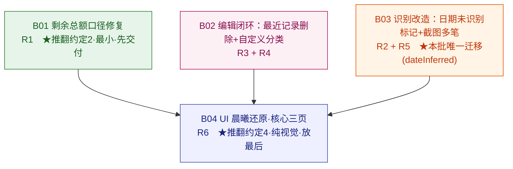

# 反馈批次 01 开发 DAG — 剩余总额 / 日期填充 / 最近记录删除 / 自定义分类 / 截图多笔 / UI 还原

> 模式 `existing_batch`：Aubade v1（N00~N07 已合并 main）真机验收后的一批反馈修复/增强。本 DAG 把技术基线（`docs/design/batch01-feedback-fixes-technical-baseline.md`）里的 6 条需求（R1~R6）与 7 个决策，收敛为 **4 个可依次开发、边界清晰的节点（B01~B04）**，并画清先后依赖、每个节点的退出标准、连带的迁移与测试影响。
>
> 上游事实来源：批次 PRD `docs/prd/batch01-feedback-fixes-prd.md`、批次原型 `docs/design/batch01-feedback-fixes-prototype.md`、批次技术基线 `docs/design/batch01-feedback-fixes-technical-baseline.md`；代码事实来源：逐文件阅读核实（本仓库无 `.codegraph/`），行号为写作时快照，可能 ±1 漂移。

## 给用户看的摘要

这批 6 条反馈，我按"改动面 + 代码触点内聚性"拆成 **4 个一个接一个做的节点**，顺序就是节点编号顺序，核心思路是"**先修可信数字、再补编辑闭环、再动识别解析链、UI 大改放最后避免和逻辑改动打架**"：

1. **B01 剩余总额口径修复（R1）**：最小、最急。就改 `BalanceCalculator` 那一行日期过滤 + 在初始总额录入处加一句提示（你拍板的"填当前净值、别补录历史账"）。**推翻 v1 约定 2**，连带改 1 个单测。做完"记一笔、剩余就对"。
2. **B02 编辑闭环：最近记录删除 + 自定义分类（R3 + R4）**：两条都是"补基本盘"、都在账单/分类的 UI + Store 层，合成一个节点。R3 把记账页最近记录改成 `List` 支持左滑删（和账单页一套交互）；R4 补 Store 三个方法（改分类/删时保护预置/查引用数）+ 我的页分类区从只读改成能增删改，删被引用的分类时账单**转到"其他"**。
3. **B03 识别改造：日期未识别标记 + 截图多笔（R2 + R5）**：改动最大、都在识别解析链，按你拍板**合并成一个节点**。R5 把"一张截图识别一笔"改成"识别多笔、逐条可改可删"，**前台相册选图和后台快捷指令都多笔**（文本识别保持单笔）；R2 让"日期没识别出来"这件事被你看见——你拍板**给 `Transaction` 加一个 `dateInferred` 标记字段**，所以这个节点会带**一次 SwiftData 轻量迁移**（本批唯一的迁移）。
4. **B04 UI 晨曦还原·核心三页（R6）**：纯视觉，面最广，放最后。先建一套设计 token（暖米白底、晨曦渐变、珊瑚/青绿语义色、22px 圆角、粗体层次），再还原**记账/账单/我的三页**（统计页和识别结果卡后续再跟）。**推翻 v1 约定 4**（收入色从系统绿改青绿、支出色从主文本色改珊瑚）。**不动任何数据和业务逻辑。**

**为什么这么拆**：B01 几行改动立竿见影、单独先交付；B02 两条编辑闭环触点邻近（都碰账单行/分类/Store）合成一节；B03 R2+R5 改的是同一批识别文件，合并避免解析层动两遍；B04 视觉大改独立放最后，避免和 B01~B03 的逻辑改动交叉冲突。B04 依赖前三者是为了"在最终形态的页面上一次性统一视觉"，不在半成品上刷样式。

**需要你确认什么**：主要是这个**4 节点的拆分、顺序、依赖**认不认可——尤其 (a) R3+R4 合成 B02、(b) R2+R5 合成 B03 并带一次迁移、(c) R6 放最后且先做核心三页。你之前已拍板的 4 个关键决策（R2/R5 合并、加 `dateInferred` 字段、截图前后台都多笔、R6 核心三页先行）和 7 个低风险默认项都已写进下面的"批次决策台账"。

**另有 1 个开放待确认项请你顺带拍板**：预置分类（衣/食/住/行等）除了"禁删、禁改名"，**要不要允许改它们的图标/颜色**？技术基线把这项留为开放，本 DAG 暂按"锁全部字段（图标色也不给改）"推进——你若希望预置分类能换图标/色，评审时说一声，我调 B02 范围。

如果认可，回复 **"DAG 评审通过"**，我就初始化第一个节点 B01 进入正式节点 PRD/TRD 开发。

---

## 当前 Jflow 模式

- 模式：`existing_batch`（情况三：已有系统新增一组需求）。
- 阶段：`dag`（技术基线已由用户明确评审通过，本文档为 DAG 阶段产物）。
- 本 DAG **不从 0 到 1**，全程依赖 v1 既有代码事实，只对既有链路做修复/增强。
- 本 DAG 是本批**节点顺序、依赖、退出标准**的事实来源；不写实现代码，不替代节点 PRD/TRD。

## 项目文档路径

- 批次 PRD：`docs/prd/batch01-feedback-fixes-prd.md`
- 批次原型：`docs/design/batch01-feedback-fixes-prototype.md`
- 批次技术基线：`docs/design/batch01-feedback-fixes-technical-baseline.md`
- 批次开发 DAG：`docs/design/batch01-feedback-fixes-dev-dag.md`（本文件）
- 真实交互 demo：`prototype/app/index.html`（v1 demo 上增量扩展）

节点级正式文档（选中节点后由 Jflow 按需创建）：

- 节点 PRD：`docs/prd/nodes/<nodeId>-<slug>-prd.md`
- 节点 TRD 索引：`docs/design/nodes/<nodeId>-<slug>/00-index.md`
- 节点 TRD 切片：`docs/design/nodes/<nodeId>-<slug>/01-<slice>-trd.md`（按需递增）
- 节点切片进度：`docs/design/nodes/<nodeId>-<slug>/99-slice-progress.md`

> 节点编号用 **B01~B04**（batch01 命名空间），与 v1 的 N00~N07 区分，避免与既有 `docs/*/nodes/n0x-*` 目录冲突。

## 个人恢复规则

- `docs/design/batch01-feedback-fixes-dev-dag.md`（本文件）是 DAG 节点状态、依赖关系和退出标准的事实来源。
- `docs/prd/nodes/*.md` 是正式节点 PRD 的事实来源；`docs/design/nodes/*/00-index.md` 及同目录切片文件是正式节点 TRD 的事实来源。
- `.claude/jflow/` 只保存 active 执行状态、dev-log、handoff 和恢复指针。
- 除非用户明确要求，否则每次 Jflow 调用最多实现一个当前 TRD 切片。
- 下一次恢复时，优先读取 `.claude/jflow/current.json`、当前节点 `handoff.md`、节点 `99-slice-progress.md` 和本 DAG。

## DAG



> 图中每条箭头对应"节点追踪表"里的一条**直接依赖**（指向节点 = 前置必须先完成）。绿色 = 最小 bug 修复先交付；橙色 = 带 SwiftData 迁移的最大改动节点；蓝色 = 纯视觉、依赖前三者最终形态。

依赖说明：

- **B01** 无依赖，可立即开始（只碰 `BalanceCalculator` + 两个录入处提示文案，与其余节点无代码交叉）。
- **B02** 无强依赖，可与 B01 并行或紧随（碰账单行/最近记录/分类/Store，与 B01 的 Analytics 层不交叉）。为降低协调成本，**推荐顺序** B01 → B02。
- **B03** 无强依赖（碰识别解析链 `Parsing/`、`RecognitionEntry`、结果卡、`BackgroundIntakeService`、`Transaction` 模型加字段），与 B01/B02 触点不重叠。推荐顺序上排在 B02 后。
- **B04** **依赖 B01 + B02 + B03**：R6 是对记账/账单/我的三页的**视觉重做**，这三页的**最终交互形态**由 B02（最近记录改 `List`、分类管理区）、B03（多笔结果卡、日期未识别标记行）、B01（初始总额提示）共同决定。在半成品页面上刷样式会返工，故 B04 放最后、在三者完成后统一还原。

> **依赖性质说明**：B01/B02/B03 三者相互**代码独立**（触点不重叠），理论上可并行；箭头只表达"B04 必须在三者之后"。推荐串行顺序 B01→B02→B03→B04 是为降低单人协调成本与自评审复杂度，非硬性技术依赖。

## 节点状态

状态取值：`todo`（未开始）/ `in_progress`（进行中）/ `done`（已完成）/ `blocked`（被阻塞）。

当前整体状态：**B01 `done`；B02/B03/B04 `todo`**。下一个可开发节点为 **B02**（无依赖，推荐紧随 B01）。

## 节点追踪表

| Node ID | 名称 | 状态 | 依赖 | 对应需求 | 关键标记 |
|---|---|---|---|---|---|
| B01 | 剩余总额口径修复 | done | — | R1 | 推翻约定2；改 1 单测；含 D7 提示文案 |
| B02 | 编辑闭环：最近记录删除 + 自定义分类 | todo | — | R3 + R4 | List 侧滑删；Store 补 3 法；删分类转"其他" |
| B03 | 识别改造：日期未识别标记 + 截图多笔 | todo | — | R2 + R5 | **本批唯一迁移**（`dateInferred`）；单笔→多笔全链路；前后台截图多笔 |
| B04 | UI 晨曦还原·核心三页 | todo | B01, B02, B03 | R6 | 推翻约定4；建 token 层；纯视觉不动逻辑；核心三页先行 |

## 批次决策台账

> 技术基线列出 7 个决策点（D1~D7）+ 若干待确认。以下是**本 DAG 采纳的口径**，作为各节点 PRD/TRD 的上游约束。分两类：**① 用户已明确拍板**（问答确认）；**② 按技术基线建议默认采纳的低风险项**（用户未逐个否决，如需调整可在 DAG 评审时提出）。

### ① 用户已明确拍板（4 项，直接决定节点拆分/迁移）

| 决策 | 拍板结论 | 影响 |
|---|---|---|
| **D4** R2/R5 是否合并节点 | **合并为一个识别改造节点**（B03） | R2+R5 同批识别文件一次改完，避免解析层动两遍 |
| **D6** R2 日期未识别标记落地 | **给 `Transaction` 加 `dateInferred` 字段** | 满足原型"列表行持久标记直到确认才消失"；**触发本批唯一 SwiftData 轻量迁移**，落 B03 |
| **D5** R5 多笔覆盖入口 | **截图前台（相册选图）+ 后台（快捷指令 N06）都多笔；文本识别保持单笔** | B03 需改 `BackgroundIntakeService` + `IntakeNotification`（后台多笔通知"已记 N 笔"）；`RecognitionEntry` 文本路径保持单笔 |
| **R6 还原范围** | **核心三页先行（记账/账单/我的）**；统计页/识别结果卡后续节点再跟 | B04 范围锁定三页；暗色模式默认不做 |

### ② 按技术基线建议默认采纳（低风险，评审可调整）

| 决策 | 采纳口径 | 落节点 |
|---|---|---|
| **D1** R3 最近记录结构选型 | 记账页最近记录 **改成 `List`** → 支持 `.swipeActions` 左滑删除，与账单页一套交互（与 B04 视觉重做协同） | B02 |
| **D2** R4 删除已引用分类归属 | 删除前把该分类账单**批量转到"其他"**再删（对齐原型，Store 加逻辑），不顺从 `.nullify` 变未分类 | B02 |
| **D3** R4 预置分类保护范围 | 预置分类**禁删、禁改名**（技术基线明确建议）；seed 幂等"删了不补回"分支因禁删而不触发。**⚠ 是否允许改预置的图标/颜色，技术基线 §9-7 列为开放待确认项**——原型 §4 默认锁全部字段，本 DAG 暂按"锁全部字段"推进，但此项请你在评审时明确拍板 | B02 |
| **D7** R1 双重扣减提示落点 | 初始总额录入处（`OnboardingView` + `RootTabView` 我的页"调整初始总额"）加**简短一句**提示"填当前净值、勿补录历史账，否则双重扣减" | B01 |
| **R4 自动分类 prompt** | DeepSeek"可选分类"清单已由全量分类 `@Query` 喂入，加自定义分类后**天然带上**，无需改识别逻辑；补一条命中自定义分类的单测即可 | B02（分类）/ 验证在 B03 无需改识别 |
| **R5 部分笔失败语义** | 一张图部分笔失败：成功的入账、失败的提示、整体**不产脏账**（沿用 v1"识别失败不落库"不变量） | B03 |
| **R6 暗色模式** | 本批**默认不做**暗色适配（demo 未含暗色） | B04 |

> 若以上 ② 类任一项与你的预期不符，请在 DAG 评审时指出，我据此调整对应节点范围后再交评审。

## 节点详情

### B01 剩余总额口径修复

- **Node ID**：B01
- **名称**：剩余总额口径修复（R1）
- **状态**：done
- **依赖**：无
- **对应需求**：R1（bug｜正确性｜P0）
- **前端范围**：无新页面；剩余总额数字口径修正（账单页 hero / 我的页）+ 初始总额录入处新增一句提示文案（Onboarding 首次引导录入 + 我的页"调整初始总额"）。
- **PRD 路径**：`docs/prd/nodes/b01-remaining-balance-fix-prd.md`
- **TRD 入口路径**：`docs/design/nodes/b01-remaining-balance-fix/00-index.md`
- **范围**：
  1. `BalanceCalculator.remaining(transactions:baseline:)`（`Aubade/Features/Analytics/BalanceCalculator.swift:12-18`）去掉 `:14` 的 `occurredAt >= establishedAt` 日期过滤，改为对全部 `transactions` 求和（口径 = 初始总额 + 全部收入 − 全部支出）。
  2. D7 提示：`OnboardingView`（首次引导初始总额录入）+ `RootTabView` 我的页"调整初始总额"入口加简短提示（填当前净值、勿补录历史账）。
- **推翻的 v1 约定**：**约定 2（仅计基线后账单）**——经核查全项目唯一过滤点就是 `BalanceCalculator.swift:14`，`StatisticsAggregator` 用统计周期区间过滤、不受影响；`establishedAt` 其余读取点均为"挑最新 baseline"或写入侧，**不可误改**。
- **测试影响**：`BalanceCalculatorTests.testBaselineBoundaryInclusive`（约 :91-102）显式锁"只计基线后"旧口径，**必改**为新口径；补一条"账单早于 `establishedAt` 也计入剩余"正向断言（对齐 PRD 验收 1）。`StatisticsAggregatorTests` 不受影响。D7 提示为 UI 文案、无单测，靠录入页面人工核对。
- **退出标准（可观察）**：先记 3 笔各 10 元支出、再录初始总额 1000 → 剩余显示 **970**（非 1000）；再记 1 笔 20 元收入 → 剩余 **990**；把某笔消费日期改到初始总额之前 → 仍计入。初始总额录入处可见双重扣减提示。单测 `testBaselineBoundaryInclusive` 更新为新口径且全绿。
- **下一次恢复入口**：`docs/design/nodes/b01-remaining-balance-fix/99-slice-progress.md`

### B02 编辑闭环：最近记录删除 + 自定义分类

- **Node ID**：B02
- **名称**：编辑闭环：最近记录删除 + 自定义分类（R3 + R4）
- **状态**：todo
- **依赖**：无（推荐排在 B01 后）
- **对应需求**：R3（交互补齐｜P1）+ R4（新功能｜P1）
- **前端范围**：记账页最近记录支持左滑删除 + 二次确认；我的页分类区从只读标签流改成可管理列表（预置锁定标记 + 自定义增删改 + 分类编辑器：方向/名称/图标/颜色）。
- **PRD 路径**：`docs/prd/nodes/b02-edit-loop-categories-prd.md`
- **TRD 入口路径**：`docs/design/nodes/b02-edit-loop-categories/00-index.md`
- **范围**：
  - **R3**：`RecordTabView` 最近记录区（约 `:343-377`）从 `VStack+Button` 改成 `List+ForEach+.swipeActions`（D1），复用 `EditorActions.makeDelete`（`Editor/EditorActions.swift:26-30`）+ 账单页同款 `confirmationDialog` 二次确认；删除后 `@Query` 自动刷新、剩余/统计同步。
  - **R4**：`LedgerStore` 补 `updateCategory`（改名/图标/色）、`delete` 的**预置保护**（isPreset=true 拒删/拒改名，D3）、引用计数（用模型反向关系 `category.transactions.count`）、**删除已引用分类先批量转"其他"再删**（D2）；`RootTabView` 分类区 `@Query` 从"仅预置"放开到全部分类，加新增/编辑/删除入口 + 分类编辑器 UI；同方向重名拒绝（原型 §5 校验）。
- **数据模型**：**不改**（`LedgerCategory` 字段已够）。
- **测试影响**：新增 `updateCategory`、预置保护、引用计数、删除已引用分类转"其他"、同方向重名拒绝用例；`RelationshipTests.testDeleteCategoryNullifiesTransaction` 现锁 `.nullify` 行为，**因 D2 改"转其他"需更新**；记账页最近记录删除→二次确认→`@Query` 刷新+剩余/统计同步用例；`PresetCategoryTests` 幂等保持。
- **退出标准（可观察）**：记账页最近记录左滑→删除→二次确认→删后消失、剩余/统计同步，与账单页一致；我的页新增自定义分类"宠物"（支出，自选图标色）→ 记账可选；编辑重命名/换色/删除自定义分类生效；预置分类点击提示"不可修改"、不进编辑；删被 N 笔引用的分类 → 提示"N 笔转到其他"→ 确认后账单转"其他"、分类删除。
- **下一次恢复入口**：`docs/design/nodes/b02-edit-loop-categories/99-slice-progress.md`

### B03 识别改造：日期未识别标记 + 截图多笔

- **Node ID**：B03
- **名称**：识别改造：日期未识别标记 + 截图多笔（R2 + R5）
- **状态**：todo
- **依赖**：无（推荐排在 B02 后）
- **对应需求**：R2（核查+改进｜P0/P1）+ R5（新功能｜较大｜P2）
- **前端范围**：识别结果卡"日期未识别"红标签 + 兜底提示行；账单列表/最近记录行"· 日期未识别"小字标记（用户改日期后消失）；截图（相册选图 + 后台快捷指令）多笔识别结果卡（逐条查看/改/删/确认）；后台多笔通知"已记 N 笔"。
- **PRD 路径**：`docs/prd/nodes/b03-recognition-multi-date-prd.md`
- **TRD 入口路径**：`docs/design/nodes/b03-recognition-multi-date/00-index.md`
- **范围**：
  - **R5 截图多笔（本批最大改动，全链路单笔→多笔）**：
    - 契约 `ParsedTransaction`（`Parsing/TransactionParsing.swift:5-12`）→ 多笔（数组/新增多笔结构）；
    - `DeepSeekClient` prompt "提取一笔"→"提取所有账单"、decode 从单对象 → 数组（`:68-85`）；
    - `RecognitionEntry.recognizeAndSave`（`TextRecognitionView.swift:12-40`）截图路径循环落多笔（文本路径保持单笔）；
    - `BackgroundIntakeService.intake`（`Shortcut/BackgroundIntakeService.swift:21-61`）后台多笔落库 + `IntakeNotification` 成功通知"已记 N 笔"（D5）；
    - 多笔结果卡新 UI（单笔复用现有 `RecognitionResultCard` 编辑）；`MockTransactionParser`（多个测试文件引用）扩展多笔；
    - **部分笔失败**：成功入账 + 失败提示 + 不产脏账（沿用 v1 不变量）。
  - **R2 日期未识别标记（D6：加字段）**：
    - `Transaction` 模型加 `var dateInferred: Bool`（默认 false）→ **本批唯一 SwiftData 轻量迁移**；
    - `RecognitionNormalizer.occurredAt(_:now:)`（`Parsing/RecognitionNormalizer.swift:18-21`）在 date==nil 兜底 now 时**标记 dateInferred=true**（保留现有"禁未来 clamp"`date>now→now`）；
    - 结果卡显示"日期未识别"高亮 + 提示行；账单列表/最近记录行据 `dateInferred` 显示小字标记；用户改日期后置 false。
- **数据模型**：**改 `Transaction`**（加 `dateInferred` 字段）→ 一次 SwiftData 轻量迁移（带默认值 false，SwiftData 自动处理）。**本批唯一迁移**。
- **推翻/沿用约定**：不推翻约定；R2 兜底数值仍为 now（约定 6 不变），只让"这是猜的"被看见；账单排序逻辑本身正确、**不改**（`LedgerTabView` `@Query(sort:\.occurredAt,.reverse)`）。
- **测试影响**：
  - R5 单→多笔硬冲突：`RecognitionEntryTests`（:45）、`BackgroundIntakeServiceTests`（:96）、`RecognitionEntryScreenshotTests`（:47）的 `count==1` 断言 → 多笔断言；`MockTransactionParser`（被多个测试文件引用，含 success/voiceSample/screenshotSample 等定值分支）+ `MockParserTests` 更新；`BackgroundIntakeServiceTests:111-117` 后台单笔 payload → 多笔；新增多笔 decode（对象数组）、多笔编排（循环落 N 笔 + 部分失败）、后台多笔通知用例。
  - R2：`RecognitionNormalizerTests.testOccurredAtFallbackAndClamp`（:50-57）保留 clamp 断言、补 `dateInferred` 标志断言；补"入账落 `dateInferred=true` / 用户改日期后置 false / 列表行据此显示标记"用例。
  - 迁移：验证加字段后旧库可轻量迁移、旧账单 `dateInferred` 默认 false。
- **退出标准（可观察）**：选含 3 笔的截图 → 结果页列 3 笔、每笔可单独改/删 → 确认后账单页出现 3 笔；部分笔失败时成功入账+失败提示+无脏账；后台快捷指令多笔截图 → 通知"已记 3 笔"。识别一条带明确日期短信 → `occurredAt` 为该日期；识别无日期文本 → 结果卡"日期未识别"提示 + 账单列表该笔带小字标记，改日期后标记消失。相关单测全绿、迁移无数据丢失。
- **下一次恢复入口**：`docs/design/nodes/b03-recognition-multi-date/99-slice-progress.md`

### B04 UI 晨曦还原·核心三页

- **Node ID**：B04
- **名称**：UI 晨曦还原·核心三页（R6）
- **状态**：todo
- **依赖**：**B01, B02, B03**（三页最终交互形态定稿后再统一还原视觉）
- **对应需求**：R6（UI 大改｜视觉层｜P2）
- **前端范围**：建立设计 token 层（颜色/圆角/字重/间距/语义色）；还原记账/账单/我的三页视觉——暖米白背景、晨曦渐变 hero 汇总卡、彩色入口卡、圆角卡片列表、珊瑚支出/青绿收入语义色、粗体层次。
- **PRD 路径**：`docs/prd/nodes/b04-ui-dawn-restyle-prd.md`
- **TRD 入口路径**：`docs/design/nodes/b04-ui-dawn-restyle/00-index.md`
- **范围**：
  - 新建设计 token 层（`Features/Shared/` 或新 `DesignSystem/`），token 值取自原型 `prototype/app/styles.css:4-26`（`--bg:#f6f3ee`、`--dawn` 晨曦渐变、`--expense:#e8785c`、`--income:#4fa87a`、`--r-lg:22px`、字重 800）；
  - `AmountFormat.color(for:)`（`Shared/AmountFormat.swift:37-42`）支出 `.primary`→珊瑚、收入 `.green`→青绿（**推翻约定 4**）；`CategoryStyle` 语义色对齐；
  - 逐页改样式：记账页（`RecordTabView` 晨曦 hero + 彩色入口卡）、账单页（`LedgerTabView` 圆角卡列表 + 渐变汇总）、我的页（`RootTabView` 渐变汇总 + 圆角卡）。
- **数据/业务**：**完全不动**（token 化不改任何 `@Query`/Store/聚合/编排）。
- **推翻的 v1 约定**：**约定 4（支出用主文本色/收入用系统绿）**→ 珊瑚 `#e8785c`/青绿 `#4fa87a`；对应 `AmountFormat.color` 若有断言需同步更新。
- **测试影响**：纯视觉无单测；靠真机/模拟器截图对照原型 §4 的 **8 条硬锚点**（A1 背景 #f6f3ee、A2 晨曦渐变、A3 珊瑚支出、A4 青绿收入、A5 圆角 22px、A6 彩色入口卡、A7 圆角卡列表、A8 字重 800）逐条二元判定。
- **退出标准（可观察）**：核心三页（记账/账单/我的）呈现晨曦暖白视觉，A1~A8 八条硬锚点逐条通过；与原型 `prototype/app/` 神似；数据与业务逻辑无回归（复跑既有单测全绿）。
- **下一次恢复入口**：`docs/design/nodes/b04-ui-dawn-restyle/99-slice-progress.md`

---

## 需求→节点覆盖映射

| PRD 需求 | 落在节点 | 备注 |
|---|---|---|
| R1 剩余总额口径修复 | B01 | 推翻约定 2 + D7 提示 |
| R2 消费日期填充/未识别可见性 | B03 | 与 R5 合并；加 `dateInferred` 字段（D6） |
| R3 最近记录删除 | B02 | 改 List 侧滑（D1），复用账单页删除 |
| R4 自定义分类增删改 + 自动分类 | B02 | Store 补 3 法 + 删转"其他"（D2）+ 预置保护（D3） |
| R5 截图多笔识别 | B03 | 前后台截图多笔（D5）；文本单笔 |
| R6 UI 按原型还原 | B04 | 核心三页先行；推翻约定 4；纯视觉 |

## SwiftData 迁移与约定变更汇总

- **迁移**：本批**唯一迁移**在 **B03**——`Transaction` 加 `dateInferred: Bool`（默认 false，SwiftData 轻量迁移自动处理）。B01/B02/B04 **无迁移**。
- **推翻 v1 约定**：
  - **约定 2**（仅计基线后账单）→ B01 改为全量求和。
  - **约定 4**（支出主文本色/收入系统绿）→ B04 改珊瑚/青绿。
  - 二者对应单测必须同步更新为新口径（B01 改 `testBaselineBoundaryInclusive`；B04 若有 `AmountFormat.color` 断言随改）。
- **沿用不变**：约定 6（识别不到日期兜底 now）数值不变，B03 只让其可见；账单排序逻辑不改；失败不产脏账不变量沿用。

## 节点选择与 Handoff

用户明确 **"DAG 评审通过"** 后，选择第一个无依赖节点 **B01**，用正式 docs 路径初始化 Jflow 状态：

```bash
python3 /Users/jianghaijun.20/.claude/skills/jflow-core/scripts/jflow_state.py init \
  --slug b01-remaining-balance-fix \
  --title "B01 剩余总额口径修复" \
  --docs-prd docs/prd/nodes/b01-remaining-balance-fix-prd.md \
  --docs-trd-index docs/design/nodes/b01-remaining-balance-fix/00-index.md \
  --dag docs/design/batch01-feedback-fixes-dev-dag.md
```

（实际命令以 `jflow_state.py init --help` 支持的参数为准。）
